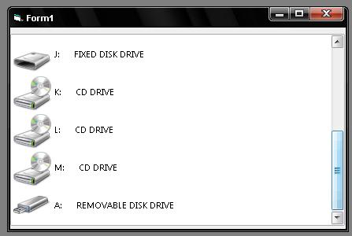



## Easyly get all drives with their custome icon \(Updated activx\)

### Description

Get all of your drives with their icons very fast. no VBscripting used. ( Sorry for the missing activx )
 
### More Info
 

             |
---                |---
**Submitted On**   |2008-10-27 00:35:24
**By**             |[Ratul Ahmed](https://github.com/Planet-Source-Code/PSCIndex/blob/master/ByAuthor/ratul-ahmed.md)
**Level**          |Beginner
**User Rating**    |5.0 (10 globes from 2 users)
**Compatibility**  |VB 6\.0
**Category**       |[Miscellaneous](https://github.com/Planet-Source-Code/PSCIndex/blob/master/ByCategory/miscellaneous__1-1.md)
**World**          |[Visual Basic](https://github.com/Planet-Source-Code/PSCIndex/blob/master/ByWorld/visual-basic.md)
**Archive File**   |[Easyly\_get2133061132008\.zip](https://github.com/Planet-Source-Code/ratul-ahmed-easyly-get-all-drives-with-their-custome-icon-updated-activx__1-71294/archive/master.zip)

